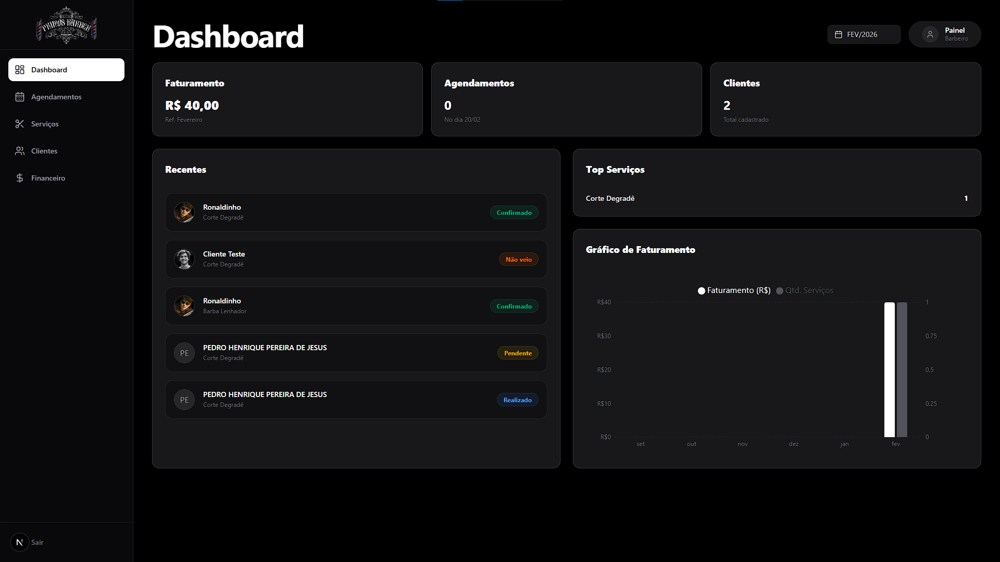
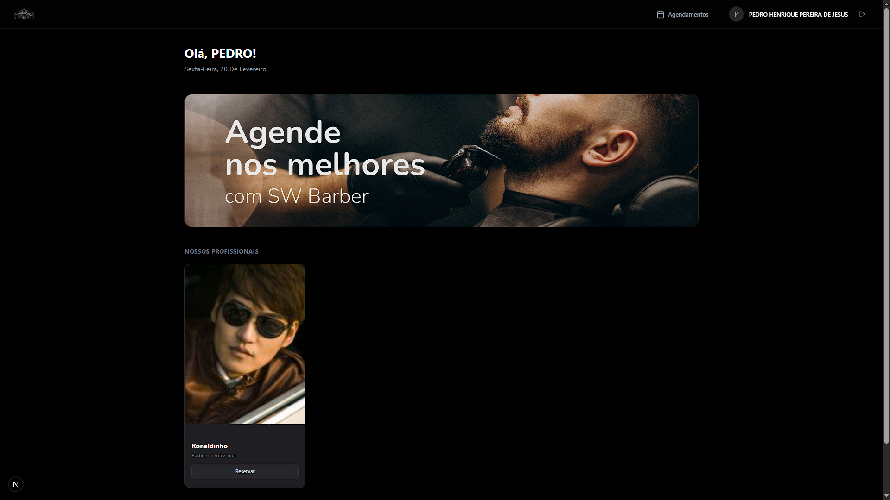

# 🚀 Preview Barbearia - Sistema de Gestão e Agendamentos

> **Aviso de Confidencialidade:** Este é um repositório de **portfólio**. As informações contidas aqui (como nomes de clientes, logotipos, marcas e dados de contato) são **fictícias** ou foram alteradas para preservar a identidade do cliente real e respeitar acordos de confidencialidade (NDA). O projeto original está em uso contínuo em ambiente de produção.

Um sistema completo de gerenciamento e agendamentos desenvolvido sob medida para uma barbearia moderna e premium. A plataforma permite que os clientes agendem seus cortes e serviços de estética com total facilidade, enquanto oferece aos barbeiros e administradores um painel robusto para gerenciar horários, métricas financeiras e fluxo de clientes no estabelecimento.

---

## 📸 Preview


<div align="center">
  
</div>

<div align="center">
  
</div>

---

## ✨ Funcionalidades Principais

### Experiência do Cliente:

- **Agendamento Inteligente:** Interface guiada e limpa para seleção de profissionais, serviços e horários disponíveis na agenda real do salão.
- **Painel do Cliente:** Espaço dedicado onde o cliente visualiza todo seu histórico, confirmando status (Pendente, Aprovado, Concluído) ou realizando cancelamentos.
- **Layout Responsivo:** Desenvolvido no conceito Mobile-first, garantindo que o seu cliente consiga marcar um horário de qualquer dispositivo celular.
- **Navegação Eficiente:** Fluxos aprimorados e simplificados para facilitar o retorno à página principal ou explorar outros serviços.

### Painel Administrativo / Profissionais:

- **Dashboard Analítico:** Visão panorâmica dos dados do negócio, incluindo painéis de receita mensal/diária, métricas e serviços prestados com gráficos interativos.
- **Gestão de Horários e Escalas:** Controle em tempo real, evitando conflito de marcações e permitindo remarcações.
- **Autenticação Segura:** Login utilizando JWT com roles e permissões de acesso diferenciadas.
- **Notificações:** Gatilhos e envio de e-mails para garantir um fluxo de comunicação dinâmico usando processamento de plano de fundo.

---

## 🛠️ Tecnologias Utilizadas

A arquitetura foi pensada mesclando alta performance, baixa latência e integração robusta entre pontas:

### 💻 Frontend (Web / App client-side)

- **Framework:** [Next.js](https://nextjs.org/) (React 19)
- **Linguagem:** [TypeScript](https://www.typescriptlang.org/)
- **Estilização:** [Tailwind CSS](https://tailwindcss.com/)
- **Componentização:** [Radix UI](https://www.radix-ui.com/) para primitivos de acessibilidade.
- **Formulários e Validação:** [React Hook Form](https://react-hook-form.com/) integrado nativamente com [Zod](https://zod.dev/).
- **Data Viz:** [Recharts](https://recharts.org/) para monitoramento gráfico da receita.

### ⚙️ Backend (API REST)

- **Framework:** [Fastify](https://fastify.dev/) focado em altíssima performance estrutural.
- **Linguagem:** [TypeScript](https://www.typescriptlang.org/) e Node.js.
- **Banco de Dados & ORM:** [Prisma](https://www.prisma.io/) acoplado ao banco relacional.
- **Segurança:** Autenticação gerenciada via `jsonwebtoken` e `bcrypt` para hash de senhas.
- **E-mails e Workers:** [Resend](https://resend.com/) com rotinas engatilhadas por agendadores tipo `node-cron`.

---

## 🚀 Como Rodar o Projeto Localmente

Se você deseja avaliar o código nativamente na sua máquina, siga este guia:

### Pré-requisitos

- **Node.js**: `v18+` ou mais recente.
- **Banco de Dados Relacional**: Instância PostgreSQL rodando localmente ou no docker.

### 1. Preparando o Backend

```bash
# Navegue até a pasta da API
cd backend

# Instale as dependências
npm install

# Crie seu arquivo .env com base em um env.example
# Nele as principais chaves são: DATABASE_URL, JWT_SECRET e configs do Resend.

# Rode a geração do cliente Prisma e aplique a estrutura do banco
npm run prisma:generate
npm run prisma:migrate dev

# Inicie o servidor
npm run dev
```

### 2. Preparando o Frontend

```bash
# Abra outro terminal e navegue à pasta cliente
cd frontend

# Instalação dos pacotes
npm install

# Configure a URL local do backend no .env.local
# Ex: NEXT_PUBLIC_API_URL=http://localhost:3333

# Start no modo de desenvolvimento
npm run dev
```

Após isso, acesse `http://localhost:3000` em seu navegador para visualizar a plataforma.

---

## 🏗️ Conceitos Arquiteturais e Boas Práticas

Durante todo o desenvolvimento, algumas decisões ajudaram a moldar e evoluir o sistema:

- **Refatoração com "Custom Hooks":** Lógicas complexas assíncronas (como consultas de Dashboard, e validações de rotas protegidas) foram desacopladas em utilitários focados e isolados.
- **Cores e Design System:** Foram construídas paletas estritas equilibrando tons escuros, brancos e cinzas.
- **Integração Tipada:** Modelos de Payload trafegados entre Back e Front são mantidos garantindo que qualquer quebra da interface seja avisada durante transação de build pelo TS.

## 📄 Licença

Todo o conteúdo que compõe este repositório possui fins **estritamente voltados a portfólio prévio**. Direitos patrimoniais reservados; não é autorizada hospedagem em servidores públicos para uso comercial sem devido aviso.

> Desenvolvido com muito café, acessibilidade e paixão por experiências completas! 🚀
